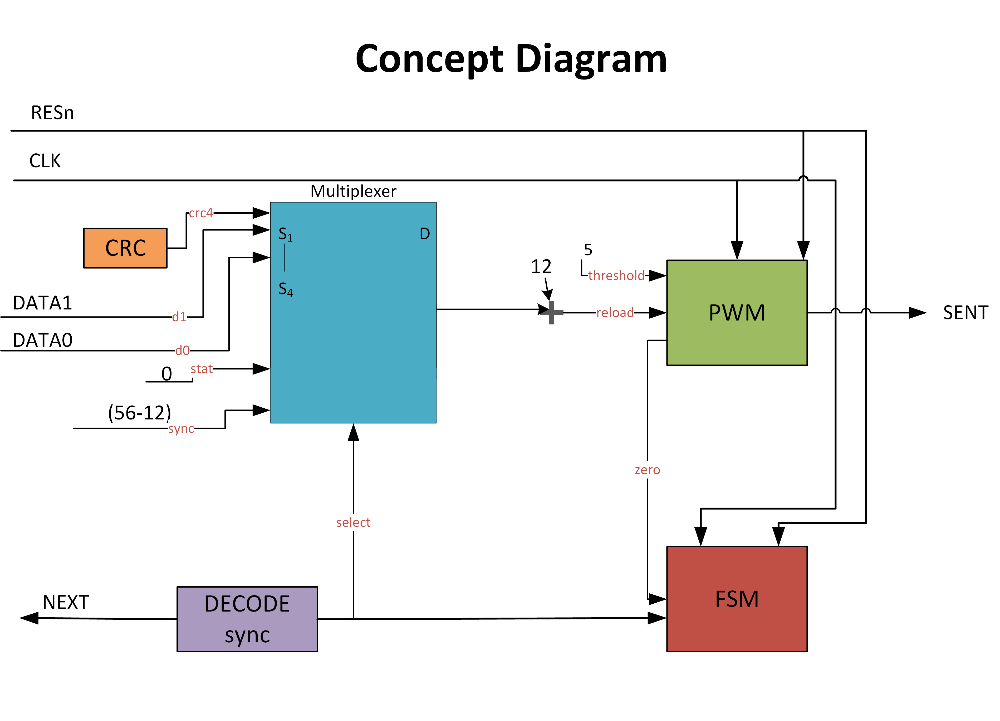
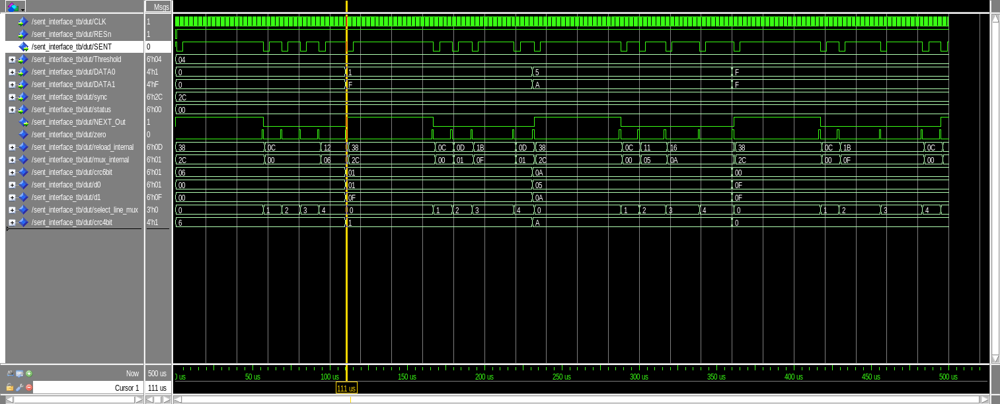
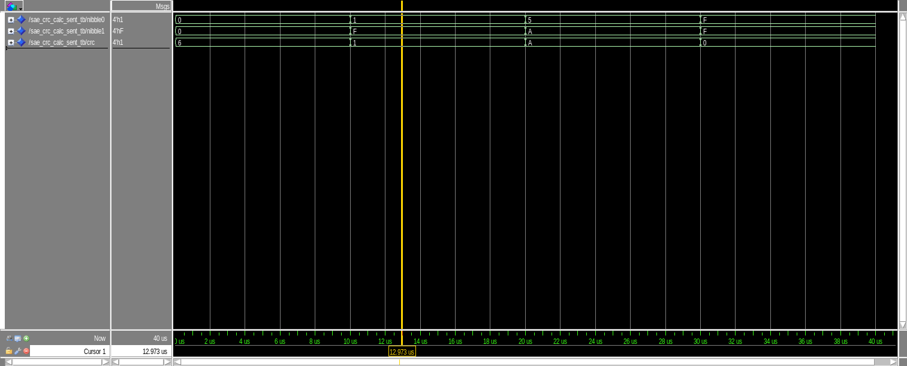
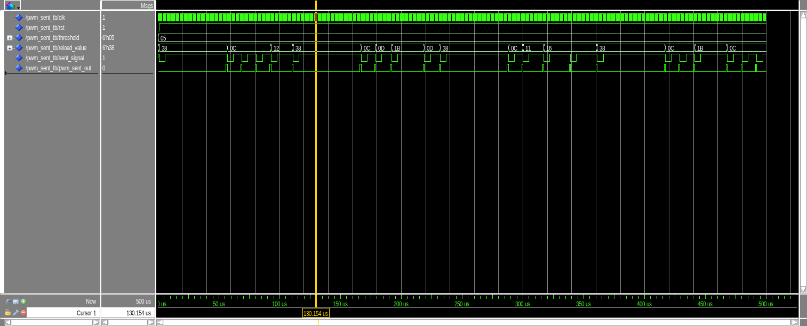
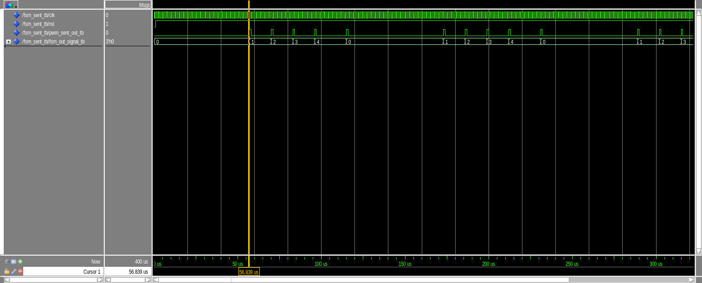
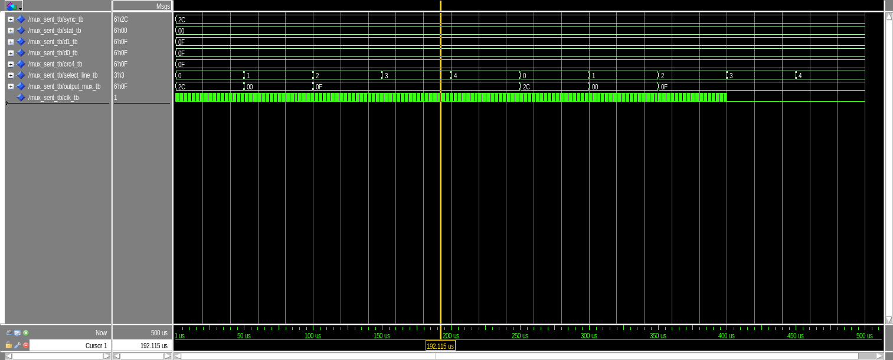

````markdown
# J2716 SENT Transmitter (VHDL)

This repository contains my VHDL implementation of a **SAE J2716 SENT (Single Edge Nibble Transmission) transmitter**.

The project includes:

- Synthesizable VHDL source files  
- Unit-level and top-level testbenches  
- ModelSim/Questa `.do` scripts  
- Simulation waveforms (screenshots)

I did this as part of my digital design course/lab.

---

## 1. What is SENT (short)

SENT (Single Edge Nibble Transmission) is a **unidirectional, time-based** protocol.  
Data is sent on a single line (`SENT`) by changing the time between rising edges.

Each 4-bit nibble (`0` to `15`) is sent as a pulse with a certain length:

> `ticks = 12 + nibble`

- Base: 12 ticks  
- Nibble range: 0…15 → 12…27 ticks  

A frame in this project has:

1. SYNC  
2. STATUS nibble (fixed 0)  
3. DATA0 nibble (lower 4 bits)  
4. DATA1 nibble (upper 4 bits)  
5. CRC nibble (4-bit CRC over STATUS, DATA0, DATA1)

Clock used: **1 MHz**, so **1 tick = 1 µs**.

For more background on SENT, I used this article as a reference:  
[Understanding the SENT interface](https://www.edn.com/understanding-the-sent-interface/)

---

## 2. Repository structure

```text
j2716-sent-transmitter/
├─ rtl/
│  ├─ CRC4_SENT.vhd           -- 4-bit CRC encoder
│  ├─ SAE_CRC_CALC_SENT.vhd   -- reference / alternative CRC
│  ├─ PWM_SENT.vhd            -- tick-based pulse generator
│  ├─ FSM_SENT.vhd            -- frame state machine
│  ├─ MUX_SENT.vhd            -- selects tick count per nibble
│  └─ SENT_interface.vhd      -- top-level SENT transmitter
├─ sim/
│  ├─ CRC4_SENT_tb.vhd
│  ├─ SAE_CRC_CALC_SENT_tb.vhd
│  ├─ PWM_SENT_tb.vhd
│  ├─ FSM_SENT_tb.vhd
│  ├─ MUX_SENT_tb.vhd
│  └─ SENT_interface_tb.vhd   -- top-level testbench
├─ scripts/
│  ├─ setup.do                -- runs SENT_interface_tb
│  ├─ setup_crc.do            -- CRC tests
│  ├─ setup_pwm.do            -- PWM tests
│  ├─ setup_fsm.do            -- FSM tests
│  └─ setup_mux.do            -- MUX tests
├─ images/
│  ├─ concept_diagram.png     -- high-level block diagram (redrawn by me)
│  ├─ CRC_waveform.bmp
│  ├─ PWM_waveform.bmp
│  ├─ FSM_waveform.bmp
│  ├─ MUX_Waveform.bmp
│  └─ SENT_top.bmp
└─ README.md
````

---

## 3. Top-level design (`SENT_interface`)

### 3.1 Concept diagram



Simple idea of the architecture:

* `DATA0` and `DATA1` are the 4-bit nibbles that form the payload byte.
* A CRC block calculates a 4-bit CRC nibble using STATUS, DATA0 and DATA1.
* SYNC, STATUS, DATA0, DATA1 and CRC are all mapped to tick values.
* A MUX selects which field is currently being sent (SYNC / STATUS / DATA0 / DATA1 / CRC).
* The selected tick value goes into the PWM block, which generates the actual `SENT` pulse and an “end-of-nibble” signal.
* A simple FSM (Medvedev style) steps through the fields in order.
* A small logic block generates `NEXT_Out` so new data can be loaded at the correct time.

### 3.2 Top-level entity (simplified)

```vhdl
entity SENT_interface is
  port (
    CLK        : in  STD_LOGIC;                     -- 1 MHz clock
    RESn       : in  STD_LOGIC;                     -- active-low async reset

    SENT       : out STD_LOGIC;                     -- SENT output line

    Threshold  : in  UNSIGNED(5 downto 0);          -- high-time threshold
    DATA0      : in  STD_LOGIC_VECTOR(3 downto 0);  -- lower nibble
    DATA1      : in  STD_LOGIC_VECTOR(3 downto 0);  -- upper nibble

    sync       : in  STD_LOGIC_VECTOR(5 downto 0);  -- SYNC ticks
    status     : in  STD_LOGIC_VECTOR(5 downto 0);  -- STATUS ticks

    NEXT_Out   : out STD_LOGIC                      -- handshake to data source
  );
end SENT_interface;
```

What it does (in short):

* Takes `DATA0` and `DATA1` as input data.
* Calculates the CRC nibble.
* Converts nibbles + SYNC/STATUS into tick values.
* Uses FSM + MUX + PWM to send each field with correct timing.
* Drives the final encoded waveform on `SENT`.
* Uses `NEXT_Out` to signal when new data can be applied.

---

## 4. Main building blocks (short)

I don’t explain the code line by line here, just the basic role of each module.

* **`CRC4_SENT.vhd` / `SAE_CRC_CALC_SENT.vhd`**
  4-bit CRC calculation according to SAE J2716. Used to generate the CRC nibble from STATUS, DATA0 and DATA1.

* **`PWM_SENT.vhd`**
  Tick counter and pulse generator. Takes a tick count and creates the proper high/low timing for one SENT nibble, and outputs an end-of-nibble pulse.

* **`FSM_SENT.vhd`**
  State machine that steps through: SYNC → STATUS → DATA0 → DATA1 → CRC → back to SYNC.

* **`MUX_SENT.vhd`**
  Selects which tick value (SYNC, STATUS, DATA0, DATA1 or CRC) is sent to the PWM based on the FSM state.

* **`SENT_interface.vhd`**
  Top-level that connects everything and drives the `SENT` and `NEXT_Out` signals.

---

## 5. Testbenches

All testbenches are in `sim/`:

* `CRC4_SENT_tb.vhd` and `SAE_CRC_CALC_SENT_tb.vhd`
  Check CRC calculation against expected values.

* `PWM_SENT_tb.vhd`
  Checks the PWM timing and `pwm_sent_out` pulse.

* `FSM_SENT_tb.vhd`
  Checks that the FSM goes through the field sequence correctly.

* `MUX_SENT_tb.vhd`
  Checks that the correct tick value appears at the output for each state.

* `SENT_interface_tb.vhd`
  Top-level testbench. Drives example data and observes the complete SENT frame.

---

## 6. Simulation (ModelSim / Questa)

All `.do` scripts are in the `scripts/` folder.

### 6.1 Top-level simulation

From the project root in the ModelSim/Questa console:

```tcl
do scripts/setup.do
```

This script:

1. Creates a fresh `work` library
2. Compiles all RTL files under `rtl/`
3. Compiles `sim/SENT_interface_tb.vhd`
4. Starts `SENT_interface_tb`
5. Adds signals to the waveform
6. Runs the simulation (`run -all`)

### 6.2 Block-level simulations

You can also run the unit tests:

```tcl
do scripts/setup_crc.do
do scripts/setup_pwm.do
do scripts/setup_fsm.do
do scripts/setup_mux.do
```

Each script compiles one block + its testbench and runs it.

---

## 7. Example waveforms

The `images/` folder contains screenshots from simulation.

### 7.1 Top-level SENT frame



This shows one complete SENT frame on the `SENT` line:

* SYNC
* STATUS
* DATA0
* DATA1
* CRC

You can see the different pulse lengths for each field.

---

### 7.2 CRC block



This shows how the CRC value changes as STATUS, DATA0 and DATA1 are processed and how the final CRC nibble is generated.

---

### 7.3 PWM block



This shows:

* The internal tick counter
* The high-time defined by `threshold`
* The `pwm_sent_out` pulse at the end of the nibble

---

### 7.4 FSM block



This shows the FSM going through:

* SYNC → STATUS → DATA0 → DATA1 → CRC → back to SYNC

driven by the `pwm_sent_out` pulse from the PWM block.

---

### 7.5 MUX block



This shows the selected tick value on the MUX output changing as the FSM changes state, so the PWM always gets the correct tick count for the current field.

---

## 8. Author

**Author:** Amith Nanjesh

I implemented and tested this design as part of my university digital design project on the SAE J2716 SENT protocol.

````
